# Linlithgow To Polmont

## Walk Metadata

| Attribute | Value |
| --------- | ----- |
| **Difficulty** | Easy |
| **Distance** | 9.46 KM |
| **Duration** | 2 - 2.5 hours |
| **Type** | Linear |
| **Elevation Gain** | Minimal |
| **Terrain** | Towpath, canal-side path, paved sections |
| **Can be done by public transport** | Yes |

## Getting There

**Start:** Linlithgow (Canal Basin)
- **Train**: Linlithgow Station
- **Bus**: Midland Bluebird services around town

**End:** Polmont
- **Train**: Polmont Station
- **Bus**: Midland Bluebird services around town

## Route

| Section Walked  | Distance | Date |
| --------------- | -------- | ---- |
| Linlithgow to Polmont | 9.46 km | 21-MAR-2026 |

## Description

A scenic and flat walk from Linlithgow to Polmont along the Union Canal, following the historic towpath through West Lothian's peaceful countryside. This is a perfect walk for those seeking a gentle, accessible outing with plenty of interesting landmarks and natural beauty.

1. **Depart from Linlithgow**: We began at the canal basin in Linlithgow, a historic town home to the magnificent Linlithgow Palace, visible from the walk's starting point.

2. **Avon Aqueduct**: The walk's showstopper is the impressive Avon Aqueduct, a spectacular engineering feature that carries the Union Canal over the River Avon. As we crossed this magnificent structure, we admired the engineering craftsmanship and enjoyed beautiful views of the river below. This is a magnificent testament to Scotland's engineering heritage.

3. **Wildflowers and Seasonal Beauty**: Along the towpath, we encountered blossoms, daffoldils, crocuses, and various and other wildflowers such as dandelions and lesser celandines. We spotted peacock butterflies, and also a deer on the walk. The canal is fringed with bullrushes and attracts waterfowl.

4. **Historic Mooring Sites**: The route passes mooring areas where coal boats historically docked, remnants of the canal's industrial past when it was a vital transportation link for the region's trade and commerce.

5. **Embankment Features**: We kept an eye out for embankment repair sections along the way, evidence of ongoing maintenance to preserve this historic waterway.

6. **Arrival at Polmont**: We finished our walk at Polmont, easily accessible by train and bus, making it an ideal endpoint for completing a one-way canal journey.

The entire route is flat and accessible. The combination of historic engineering, natural beauty, and peaceful countryside made this a wonderful choice for a leisurely half-day outing.

## Notes

- **Cafes, Restaurants, Pubs, and Grocery Shops**:
  - Plenty of amenities in Linlithgow at the starting point.
  - Limited facilities along the towpath; plan accordingly.
  - Shops and cafes available in Polmont at the end.
- **Public Toilets**: Public toilets in Linlithgow town centre and railway station. Limited facilities along the route. Public toilets in Polmont station.
- **Safety**: Watch for cyclists on the towpath; most are considerate, but stay alert. The cobbled surface of Avon Aqueduct can be slippery in wet conditions.
- **Wildlife**: Look out for ducks, swans, herons, and other waterfowl along the canal. Also look out for butterflies. If you are a wildflower enthusiast, spring and early summer are the best times for this walk.

## Photos

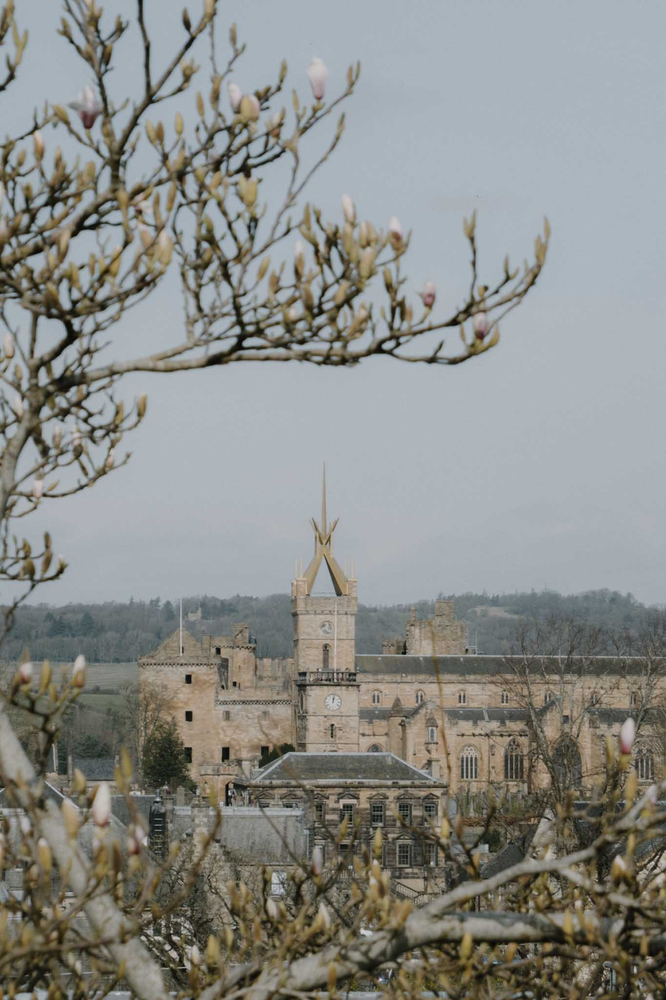

Union Canal towpath leaving Linlithgow

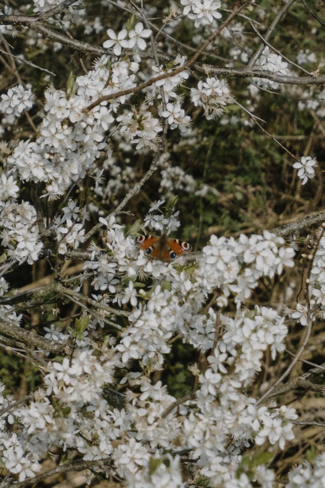

Wildflowers and butterflies along the towpath

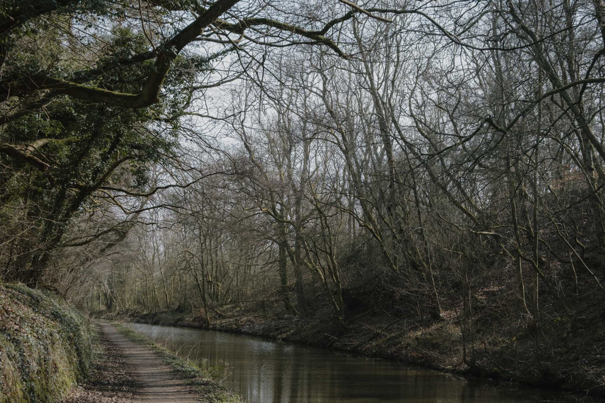

Union Canal towpath walk

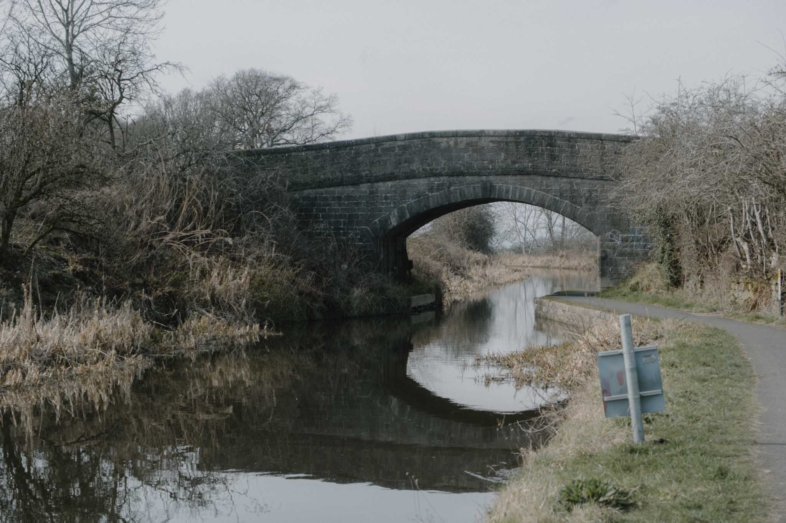

Approaching Polmont along the Union Canal

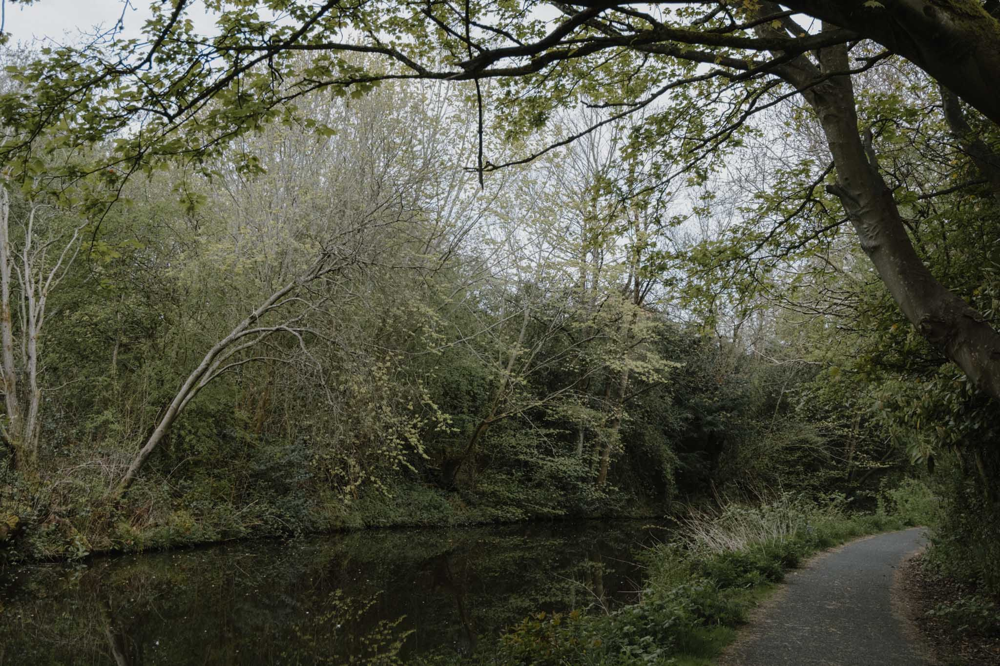

Canal scenery en route

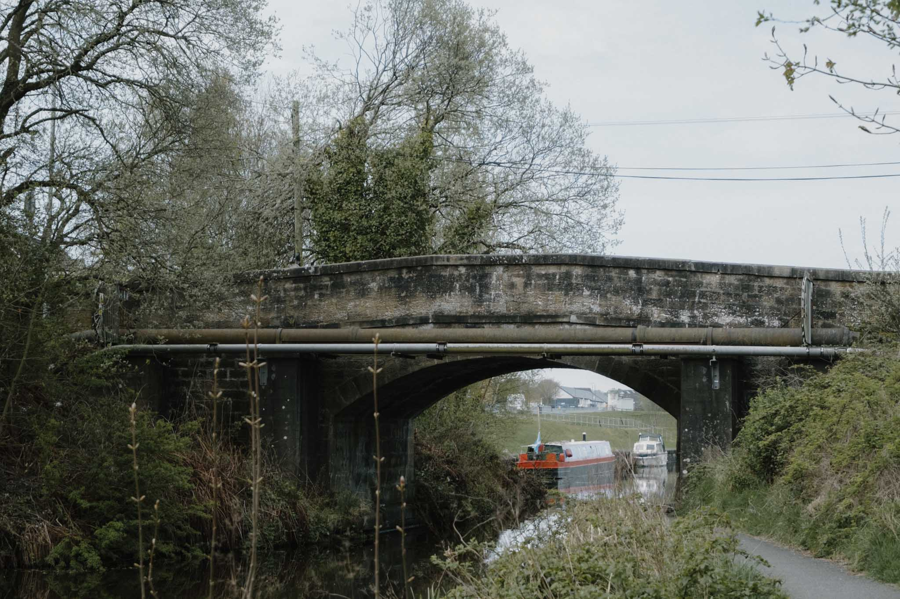

Wildflowers blooming along the towpath

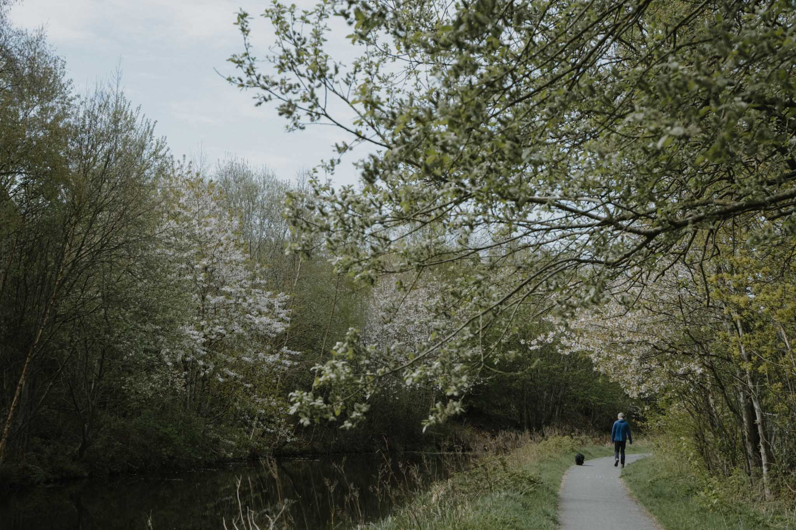

Peaceful stretch of Union Canal

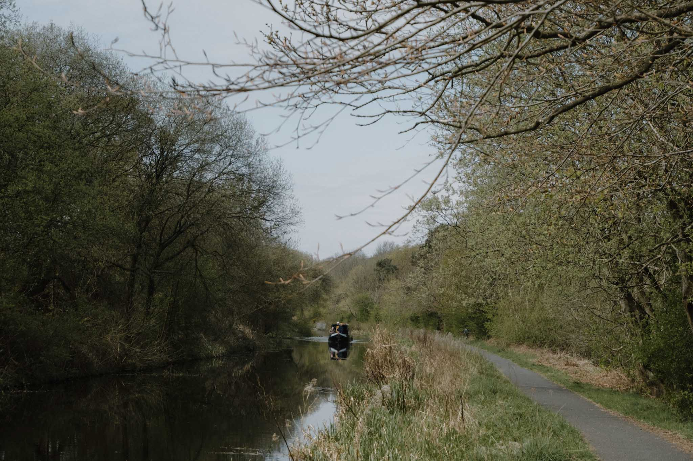

Waterfowl spotting on the canal

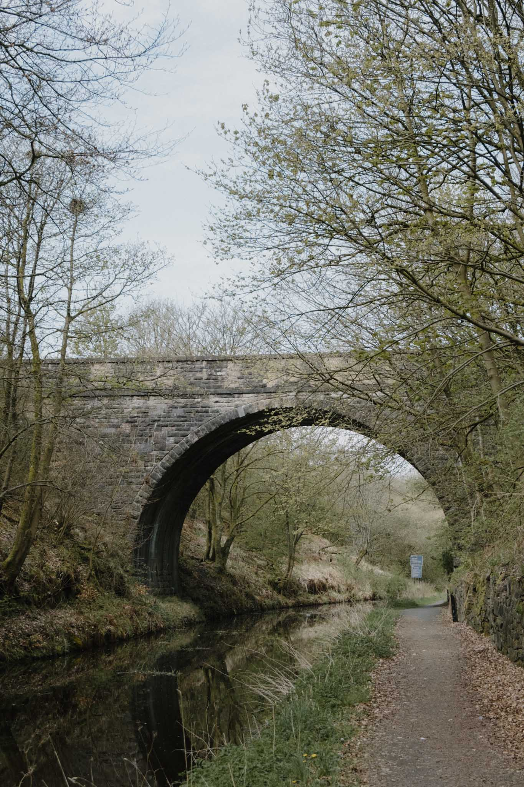

Historic towpath and embankment

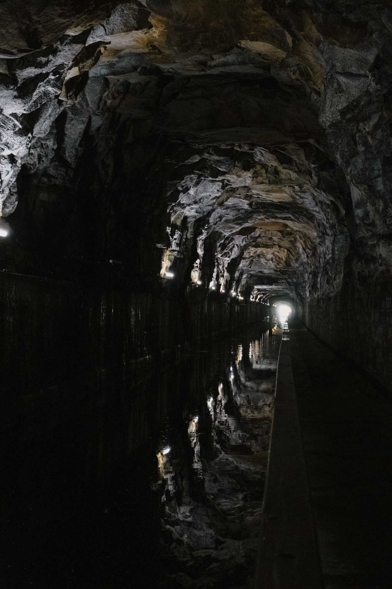

Canal bridge features

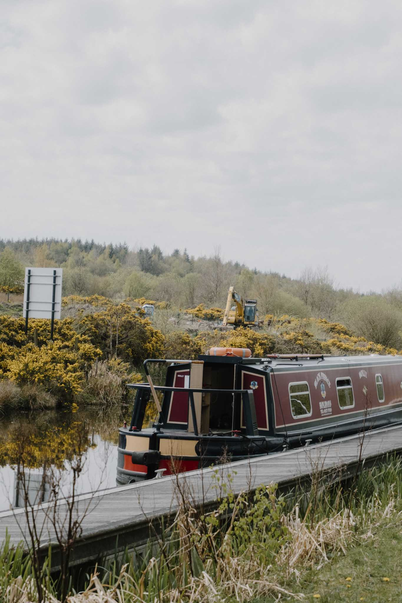

Spring blossoms near the canal

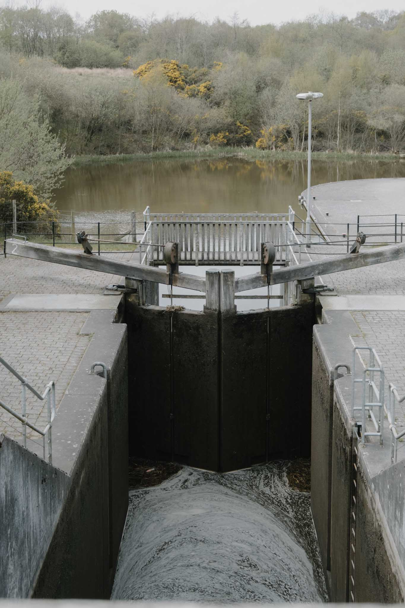

Union Canal landscape

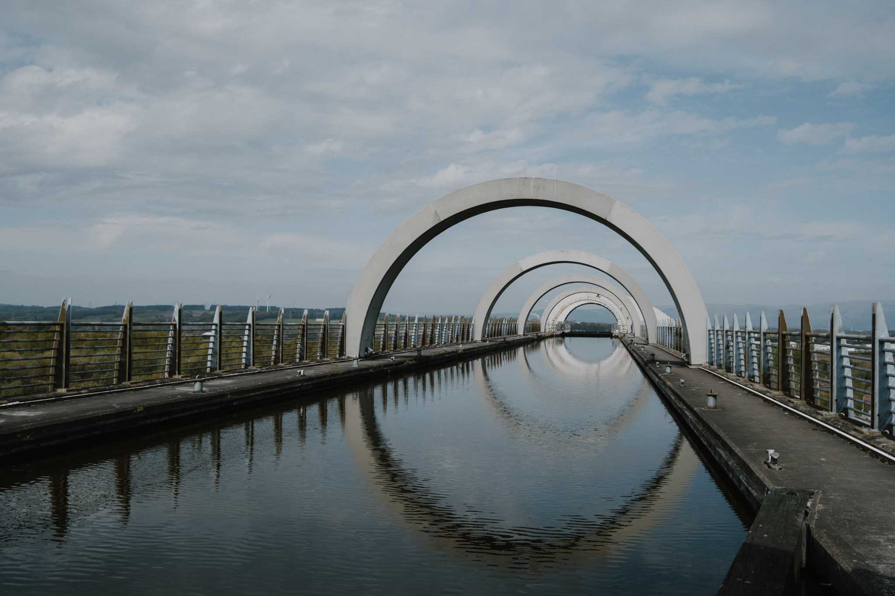

Tranquil canal towpath

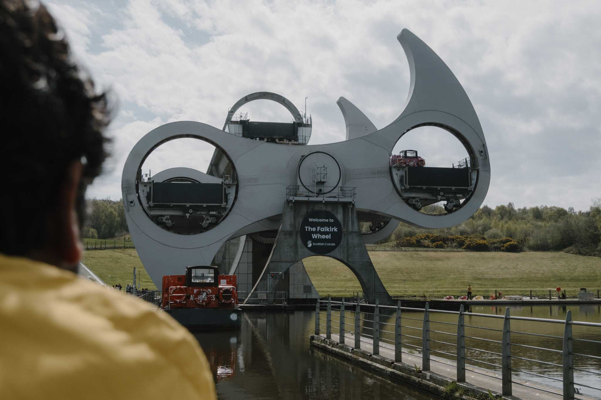

Final stretch to Polmont

